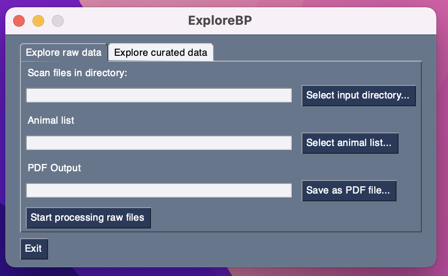
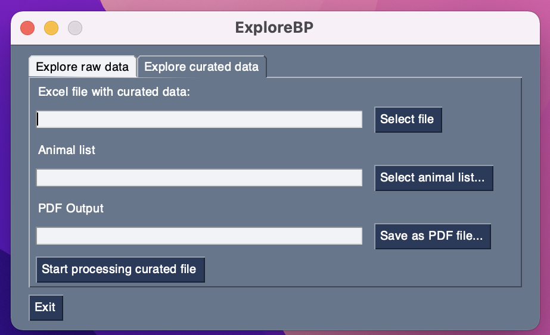

<!-- PROJECT LOGO -->
<br />
<div align="center">
  </a>

  <h3 align="center">ExploreBP</h3>

  <p align="center">
    A tool for the exploration of blood pressure telemetry data
    <br />
    ·
    <a href="https://github.com/GabStoelting/ExploreBP/issues">Report Bug</a>
    ·
    <a href="https://github.com/GabStoelting/ExploreBP/issues">Request Feature</a>
  </p>
</div>


<!-- TABLE OF CONTENTS -->
<details>
  <summary>Table of Contents</summary>
  <ol>
    <li>
      <a href="#about-the-project">About The Project</a>
    </li>
    <li>
      <a href="#getting-started">Getting Started</a>
      <ul>
        <li><a href="#prerequisites">Prerequisites</a></li>
        <li><a href="#installation">Installation</a></li>
      </ul>
    </li>
    <li><a href="#usage">Usage</a></li>
    <li><a href="#roadmap">Roadmap</a></li>
    <li><a href="#citations">Citations</a></li>
    <li><a href="#license">License</a></li>
    <li><a href="#contact">Contact</a></li>
  </ol>
</details>


<!-- ABOUT THE PROJECT -->
## About The Project

This project is the generalized version of the scripts that were developed
to explore the blood pressure telemetry data in [1] and [2]. A GUI was added to 
facilitate the use of these scripts. 
<p align="right">(<a href="#top">back to top</a>)</p>

<!-- GETTING STARTED -->
## Getting Started

This tool is written in python and will likely work with any version of python > 3.6. I recommend using <a href="https://www.anaconda.com/products/individual">Anaconda</a> or <a href="https://docs.conda.io/en/latest/miniconda.html">Miniconda</a> but this is no hard requirement. However, for the installation instructions below, I'll assume that you are able to use the conda package manager.

### Prerequisites

This tool requires python (>3.6), numpy, pandas, matplotlib and PySimpleGUI libraries. 

### Installation

Please follow these steps:

1. Clone the repository using command line tools (below) or by using a GUI version of Git
   ```sh
   git clone https://github.com/GabStoelting/ExploreBP
   ```
2. Install the required libraries via conda
   ```sh
   conda install numpy
   conda install pandas
   conda install matplotlib
   conda install PySimpleGUI
   ```
<p align="right">(<a href="#top">back to top</a>)</p>


## Usage

You can start the tool by running from the command line. 
```sh
python main.py
```

The program will start up with the "Explore raw data" tab shown:

This window contains input fields that wil contain the paths to the required folders and files.
You may define them using the buttons on the right:
* Select input directory - Upon pressing this button, you will be asked to select a directory that contains all raw files for processing
* Select animal list - In order to assign files to groups (e.g. genotypes  or treatments), you need to create a list that assigns animal IDs and files. This list needs to be in Excel format as in the AnimalList.xlsx example included in this repository. The AnimalList.xlsx file is filled with example data from the project in [1]. 
* Save as PDF file - The output will be saved in this PDF file

Upon pressing "Start processing raw files", the programm will process all files and generate a PDF file. 

The "Explore curated data" tab can be used if the blood pressure data has already been curated and stored in a single Excel file:


This screen is very similar, only that no folder but the Excel file containing the curated data can be selected in the first row.


<p align="right">(<a href="#top">back to top</a>)</p>


<!-- ROADMAP -->
## Roadmap

- [ ] Make sure everything works as intended

See the [open issues](https://github.com/GabStoelting/ExploreBP/issues) for a full list of proposed features (and known issues).

<p align="right">(<a href="#top">back to top</a>)</p>

<!-- CITATIONS -->
## Citations

Versions of this tool have been used in the following publications:
<ol>
  <li>
    <a href="https://www.pnas.org/content/118/17/e2014876118">
      Seidel, E. et al. Enhanced Ca2+ signaling, mild primary aldosteronism, and hypertension in a familial hyperaldosteronism mouse model (Cacna1hM1560V/+). PNAS 118, (2021).
    </a>
  </li>
  <li>
    <a href="https://www.nature.com/articles/s41467-019-13033-4">
      Schewe, J. et al. Elevated aldosterone and blood pressure in a mouse model of familial hyperaldosteronism with ClC-2 mutation. Nature Communications 10, 5155 (2019).
    </a>
  </li>
</ol>


<!-- LICENSE -->
## License

Distributed under the GPL 3.0 License. See `LICENSE.txt` for more information.

<p align="right">(<a href="#top">back to top</a>)</p>


<!-- CONTACT -->
## Contact

Gabriel Stölting - gabriel.stoelting@bih-charite.de
Project Link: [https://github.com/GabStoelting/ExploreBP](https://github.com/GabStoelting/ExploreBP)

<p align="right">(<a href="#top">back to top</a>)</p>